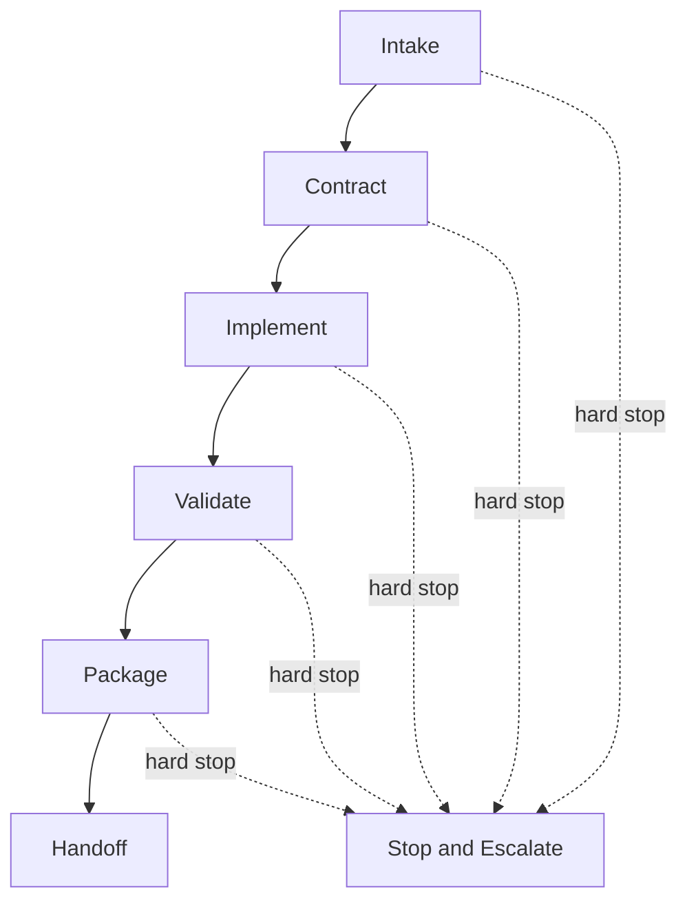

# Autonomous Development Protocol

## Purpose

Provide a predictable execution loop for autonomous development.
The agent should move from request to implementation without losing safety, scope control, or traceability.

## Loop Diagram

## Step Map

| Step      | Primary output                     | If blocked, switch to                     |
| --------- | ---------------------------------- | ----------------------------------------- |
| Intake    | target app, environment, objective | `08_ESCALATION_AND_HANDOFF.md`            |
| Contract  | task contract                      | `14_CRITICAL_GUARDRAILS_EXTRACT.md`       |
| Implement | small reversible diff              | `15_APP_BOUNDARY_AND_WORKFLOW_EXTRACT.md` |
| Validate  | execution record evidence          | `32_TEST_EXECUTION_GATE.md`               |
| Package   | change summary and residual risks  | `05_PR_TASK_CONTRACT_TEMPLATE.md`         |
| Handoff   | handoff payload                    | `08_ESCALATION_AND_HANDOFF.md`            |

## Standard Loop

### 1. Intake

- Identify target app, environment, and objective.
- Extract explicit constraints and implicit risks.

### 2. Contract

- Write the task contract before implementation.
- Lock scope, acceptance criteria, tests, and rollback.

### 3. Implement

- Make small, reversible changes.
- Keep a single change within 5 files unless the task contract explicitly scopes a larger surface.
- Keep net line delta within 200 lines unless the task contract explicitly scopes a larger surface.
- Multiple files are acceptable only when they form one logically cohesive unit.
- Avoid unrelated edits.

### 4. Validate

- Run the smallest test set that proves correctness.
- Add deeper checks when the blast radius is larger.
- If a document or issue will be reviewed from GitHub, make sure the review target is the current published state before asking for external review.

### 5. Package

- Summarize what changed, what was validated, and what remains risky.
- Align checklist state, status sections, and remote issue state before declaring review completion.

### 6. Handoff

- Use the PR task contract template.
- State open questions and reviewer focus areas.
- Do not close an issue or declare final completion without explicit user approval.

## Hard Stop Conditions

- Production-impacting work without approval.
- Missing authentication for required operations.
- App boundary violation.
- Security policy weakening.
- Architecture or requirement conflict that cannot be resolved safely.

## Required Task Record

Use the canonical Execution Record format defined in `08_ESCALATION_AND_HANDOFF.md` for task records.
