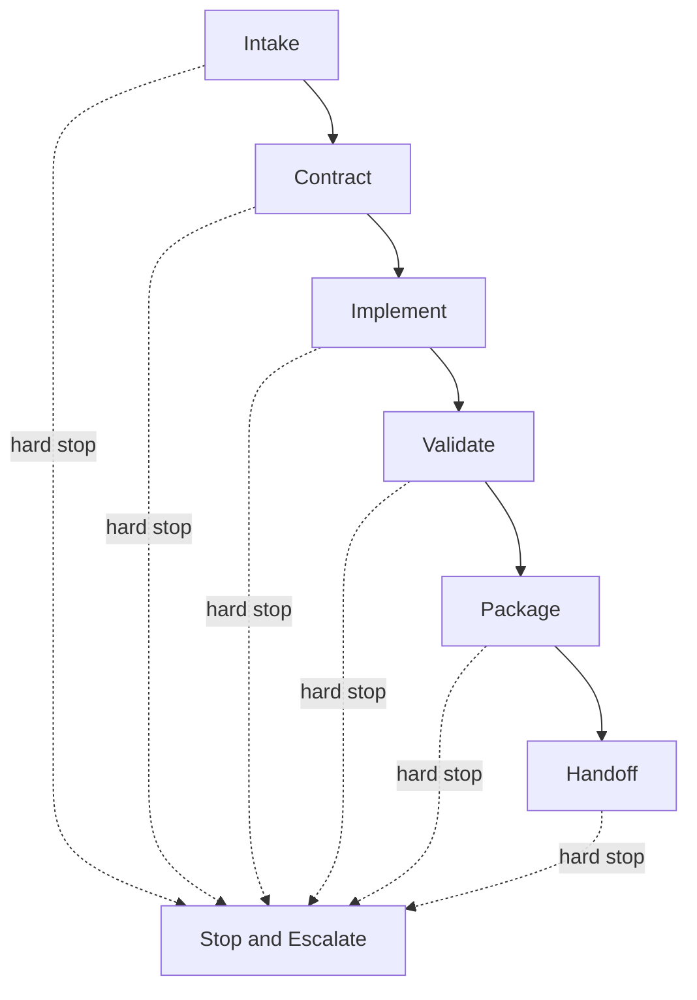

# Autonomous Development Protocol

## Purpose

Provide a predictable execution loop for autonomous development.
The agent should move from request to implementation without losing safety, scope control, or traceability.

## Loop Diagram

## Step Map

| Step      | Primary output                     | If blocked, switch to                     |
| --------- | ---------------------------------- | ----------------------------------------- |
| Intake    | target app, environment, objective | `08_ESCALATION_AND_HANDOFF.md`            |
| Contract  | task contract                      | `14_CRITICAL_GUARDRAILS_EXTRACT.md`       |
| Implement | small reversible diff              | `15_APP_BOUNDARY_AND_WORKFLOW_EXTRACT.md` |
| Validate  | execution record evidence          | `32_TEST_EXECUTION_GATE.md`               |
| Package   | change summary and residual risks  | `05_PR_TASK_CONTRACT_TEMPLATE.md`         |
| Handoff   | handoff payload                    | `08_ESCALATION_AND_HANDOFF.md`            |

## Standard Loop

### 1. Intake

- Identify target app, environment, and objective.
- Extract explicit constraints and implicit risks.

### 2. Contract

- Write the task contract before implementation.
- If all details are not known yet, write a minimum starter contract first and mark unknown fields as `TBD` rather than starting without a contract.
- Lock scope, acceptance criteria, tests, and rollback.
- Review-remediation, document-only correction, and final-review packaging passes still require their own task contract before edits start.
- If the discussion draft includes an open-questions section, format it as a three-column table with columns `Question`, `Provisional direction (at draft time)`, and `Resolution confirmed wording`. The existing Japanese labels `論点`, `判断方向（Discussion 時点の仮）`, and `Resolution 確定文言` are canonical equivalents. After human agreement, do not leave the third column as draft-only candidate wording; promote it to final wording that matches the Resolution section. The `Resolution confirmed wording` column must be filled in before writing the Resolution section. A table with any empty cell in the third column, or any row still frozen as candidate wording, is a hard stop for Resolution creation.

### 3. Implement

- Make small, reversible changes.
- Keep a single change within 5 files unless the task contract explicitly scopes a larger surface.
- Keep net line delta within 200 lines unless the task contract explicitly scopes a larger surface.
- Multiple files are acceptable only when they form one logically cohesive unit.
- Avoid unrelated edits.

### 4. Validate

- Run the smallest test set that proves correctness.
- Add deeper checks when the blast radius is larger.
- If a document or issue will be reviewed from GitHub, make sure the review target is the current published state before asking for external review.

### 5. Package

- Summarize what changed, what was validated, and what remains risky.
- Align checklist state, status sections, and remote issue state before declaring review completion.
- Do not mix unrelated uncommitted changes into an issue close or equivalent final-state transition. Separate, stash, or defer them so the close flow stays scoped to the reviewed issue.
- Commit and push evidence documents before writing a Final Review Result. The review record must reflect the published state, not a local draft.
- Do not sync a remote issue or PR body with a new Final Review Result, completion wording, or equivalent final-state language until the commit and push that introduced that wording are already published.
- Write Final Review Result only after all review comments (including low-severity items) are resolved. Do not mark Satisfied against a document that still contains open review items.
- Record human re-agreement separately from agent validation. Re-agreement can confirm that the decision basis remains accepted, but it does not imply issue close approval.
- If a human re-agreement is recorded in an issue or PR comment, state that the comment is a concise record, point the canonical wording to the source body's Resolution or equivalent final decision section, and say explicitly that the comment is not close approval.
- Keep review-state sections inside the source document aligned. Sections such as Current Draft Focus, Final Review Result, and Current Status must not point to different stages.
- If the local issue definition changes after the last remote sync, sync the remote issue or PR body again before close or any equivalent final-state transition.
- When the remote issue or PR body is sourced from a repository file, prefer a file-based sync path such as `gh issue edit --body-file <path>` or the PR equivalent instead of manually re-serializing the body through another API path.
- After the final sync, verify the published remote body for Markdown-sensitive literals such as `<env>`, inline tables, or fenced blocks. If the published body drifted from the local source of truth, resync from the file before close.

### 6. Handoff

- Use the PR task contract template.
- State open questions and reviewer focus areas.
- Do not close an issue or declare final completion without explicit user approval. Approval takes one of two forms:
  - (a) Single-issue approval: the user names or clearly designates the specific issue for close.
  - (b) Sequential-batch authorization: the user explicitly requests that a numbered series of issues be processed in order. In this case, before closing each issue, state "I will now close Issue N (<title>)" and pause one turn to allow the user to intervene. Proceeding without that pause is a protocol violation equivalent to missing approval.
- In both approval forms, the approval basis must be quoted or referenced verbatim in Process Review Notes.
- **Hard stop before next Intake**: Run `gh issue view <N> --json state` and confirm the state is `CLOSED` before accepting any new Intake. If human close approval has not been received, stop here and request review. Proceeding to a new Intake without a confirmed close is a protocol violation.
- After close is confirmed, record the closed issue number and confirmation timestamp in the execution record before starting the next Intake.

## Hard Stop Conditions

- Production-impacting work without approval.
- Missing authentication for required operations.
- App boundary violation.
- Security policy weakening.
- Architecture or requirement conflict that cannot be resolved safely.

## Required Task Record

Use the canonical Execution Record format defined in `08_ESCALATION_AND_HANDOFF.md` for task records.
