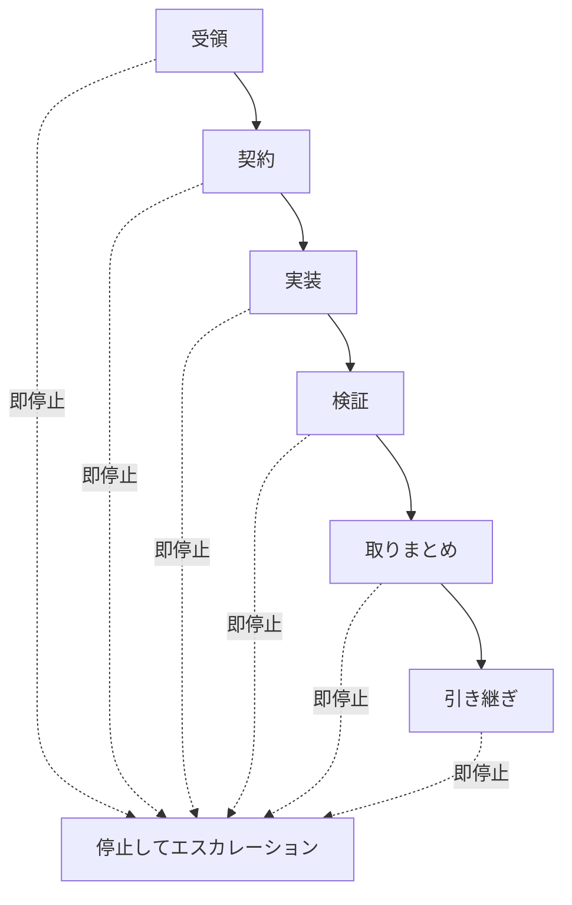

# 自律開発プロトコル

## 目的

AIエージェントが、確認可能で安全な単位で作業を進めるための標準ループを定義します。

## ループ図

## ステップ対応表

| ステップ   | 主な出力               | 詰まったら切り替える文書                  |
| ---------- | ---------------------- | ----------------------------------------- |
| 受領       | 対象アプリ、環境、目的 | `08_ESCALATION_AND_HANDOFF.md`            |
| 契約       | タスク契約             | `14_CRITICAL_GUARDRAILS_EXTRACT.md`       |
| 実装       | 小さく巻き戻せる差分   | `15_APP_BOUNDARY_AND_WORKFLOW_EXTRACT.md` |
| 検証       | 実行記録の証跡         | `32_TEST_EXECUTION_GATE.md`               |
| 取りまとめ | 変更要約と残存リスク   | `05_PR_TASK_CONTRACT_TEMPLATE.md`         |
| 引き継ぎ   | 引き継ぎペイロード     | `08_ESCALATION_AND_HANDOFF.md`            |

## 標準ループ

### 1. 受領

- 対象アプリ、環境、目的を特定する。
- 明示的な制約と暗黙のリスクを抽出する。

### 2. 契約

- 実装前にタスク契約を作成する。
- すべての詳細がまだ固まっていない場合でも、契約なしで始めず、未確定項目を `TBD` とした最小着手版の契約を先に書く。
- スコープ、受け入れ条件、テスト、ロールバックを固定する。
- レビュー指摘への是正、文書だけの修正、Final Review の取りまとめ作業であっても、編集開始前にその作業専用のタスク契約を作成する。
- Discussion Draft に論点節を置く場合は、`論点`・`判断方向（Discussion 時点の仮）`・`Resolution 確定文言` の 3 列テーブル形式で記述する。既存の英語表記を使う場合は `Question`・`Provisional direction (at draft time)`・`Resolution confirmed wording` を同義の正準名として扱う。人間合意後は 3 列目を候補文言のまま残さず、Resolution 本文と整合する確定文言へ更新する。`Resolution 確定文言` 列は Resolution セクションを書く前に必ず埋める。3 列目が空のままの行、または candidate wording のまま凍結されている行がある場合は Resolution を書いてはならない。

### 3. 実装

- 小さく、巻き戻せる変更で進める。
- タスク契約で大きなスコープを明示していない限り、1件の変更は最大 5 ファイルまでに抑える。
- タスク契約で大きなスコープを明示していない限り、差分行数は 200 行以内に抑える。
- 複数ファイルへまたがる変更は、論理的に 1 つのまとまりを成す場合に限って許容する。
- 無関係な編集を混ぜない。

### 4. 検証

- 正しさを示す最小限のテストを実行する。
- 影響範囲が大きい場合は検証を段階的に深くする。
- 文書や Issue を GitHub 上の内容でレビューしてもらう場合は、外部レビュー依頼前にその対象が最新の公開状態であることを確認する。

### 5. 取りまとめ

- 変更内容、検証結果、残存リスクを要約する。
- レビュー完了を宣言する前に、checkbox 状態、status セクション、リモート Issue 状態を揃える。
- Issue close や同等の最終状態変更の流れに、無関係な未コミット変更を混ぜない。close 対象と無関係な差分は切り分けるか、退避するか、後続タスクへ回す。
- Final Review Result を書く前に、evidence 文書をコミット・push する。レビュー記録はローカル Draft ではなく、公開状態の文書を根拠にしなければならない。
- 新しい Final Review Result、完了表現、または同等の最終状態文言を含む Issue または PR 本文は、その文言を含む commit と push が公開済みになるまで同期してはならない。
- Final Review Result は、すべてのレビュー指摘（低優先度を含む）が解消された後に書く。未解決の指摘が残っている文書に対して Satisfied を付けてはならない。
- 人間の再合意は agent validation と分けて記録する。再合意は判断根拠の受け入れを示せるが、Issue close 承認を意味してはならない。
- 人間の再合意を Issue または PR コメントに記録する場合は、そのコメントが簡潔な記録であること、正式文言の正本は本文の Resolution または同等の最終判断セクションにあること、そして close 承認ではないことを明記する。
- 根拠文書内のレビュー状態セクションも揃える。Current Draft Focus、Final Review Result、Current Status のような節が異なる段階を指してはならない。
- ローカルの Issue 定義文書が最後のリモート同期後に変わった場合は、close や同等の最終状態変更の前に、Issue または PR 本文を再同期する。
- リモートの Issue または PR 本文がリポジトリ内ファイルを正本としている場合、別経路で本文を再構成して同期するのではなく、`gh issue edit --body-file <path>` または PR の同等コマンドのような file-based sync を優先する。
- 最終同期後は、GitHub 上の公開本文に `<env>` のような Markdown-sensitive な記法、表、コードフェンスの崩れがないか確認する。公開本文がローカル正本から drift していた場合は、close 前にそのファイルから再同期する。

### 6. 引き継ぎ

- PR タスク契約テンプレートを使う。
- 未解決点とレビュー重点を明示する。
- 明示的なユーザー承認なしに Issue を close したり、最終完了を宣言したりしない。承認は次のいずれかの形式をとる:
  - (a) 個別 Issue 承認（single-issue approval）: ユーザーが close 対象 Issue を名指し、または明確に指定する。
  - (b) 連続処理一括承認（sequential-batch authorization）: ユーザーが一連の Issue を順番に処理するよう明示的に依頼した場合。この場合、各 Issue の close 前に「次に Issue N（<タイトル>）を close します」と宣言し、1 ターン待機してユーザーの介入を許可する。この待機なしに進めることは、承認欠如と同等のプロトコル違反である。
- どちらの承認形式でも、承認根拠（発言の引用または参照）を Process Review Notes に記録しなければならない。
- **次の受領へ進む前のハードストップ**: `gh issue view <N> --json state` を実行して state が `CLOSED` であることを確認してから、次の受領（Intake）を受け付ける。人間による close 承認が得られていない場合は、ここで停止してレビューを要求する。close 確認なしに次の受領へ移行することはプロトコル違反である。
- close が確認できたら、close した Issue 番号と確認日時を Execution Record に記録してから、次の受領を開始する。

## 即停止条件

- 必要な認証がない
- アプリ境界をまたぐ変更が必要
- 本番影響が大きいのに根本原因が不明
- ロールバック方法がない

## 必須記録

タスクの記録には `08_ESCALATION_AND_HANDOFF.md` で定義した正規 Execution Record 形式を使用する。
