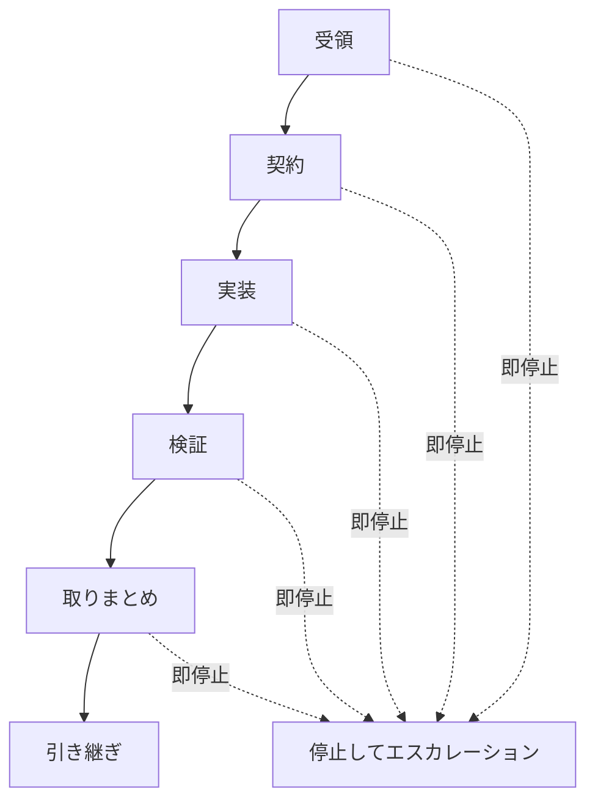

# 自律開発プロトコル

## 目的

AIエージェントが、確認可能で安全な単位で作業を進めるための標準ループを定義します。

## ループ図

## ステップ対応表

| ステップ   | 主な出力               | 詰まったら切り替える文書                  |
| ---------- | ---------------------- | ----------------------------------------- |
| 受領       | 対象アプリ、環境、目的 | `08_ESCALATION_AND_HANDOFF.md`            |
| 契約       | タスク契約             | `14_CRITICAL_GUARDRAILS_EXTRACT.md`       |
| 実装       | 小さく巻き戻せる差分   | `15_APP_BOUNDARY_AND_WORKFLOW_EXTRACT.md` |
| 検証       | 実行記録の証跡         | `32_TEST_EXECUTION_GATE.md`               |
| 取りまとめ | 変更要約と残存リスク   | `05_PR_TASK_CONTRACT_TEMPLATE.md`         |
| 引き継ぎ   | 引き継ぎペイロード     | `08_ESCALATION_AND_HANDOFF.md`            |

## 標準ループ

### 1. 受領

- 対象アプリ、環境、目的を特定する。
- 明示的な制約と暗黙のリスクを抽出する。

### 2. 契約

- 実装前にタスク契約を作成する。
- スコープ、受け入れ条件、テスト、ロールバックを固定する。

### 3. 実装

- 小さく、巻き戻せる変更で進める。
- タスク契約で大きなスコープを明示していない限り、1件の変更は最大 5 ファイルまでに抑える。
- タスク契約で大きなスコープを明示していない限り、差分行数は 200 行以内に抑える。
- 複数ファイルへまたがる変更は、論理的に 1 つのまとまりを成す場合に限って許容する。
- 無関係な編集を混ぜない。

### 4. 検証

- 正しさを示す最小限のテストを実行する。
- 影響範囲が大きい場合は検証を段階的に深くする。

### 5. 取りまとめ

- 変更内容、検証結果、残存リスクを要約する。

### 6. 引き継ぎ

- PR タスク契約テンプレートを使う。
- 未解決点とレビュー重点を明示する。

## 即停止条件

- 必要な認証がない
- アプリ境界をまたぐ変更が必要
- 本番影響が大きいのに根本原因が不明
- ロールバック方法がない

## 必須記録

タスクの記録には `08_ESCALATION_AND_HANDOFF.md` で定義した正規 Execution Record 形式を使用する。
